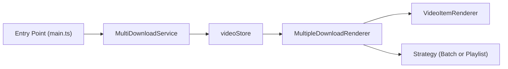
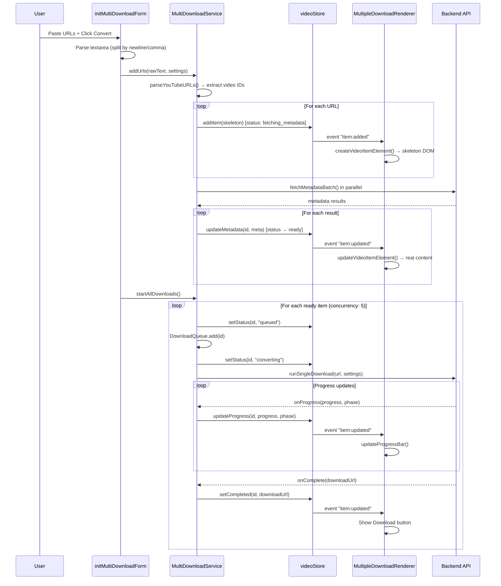
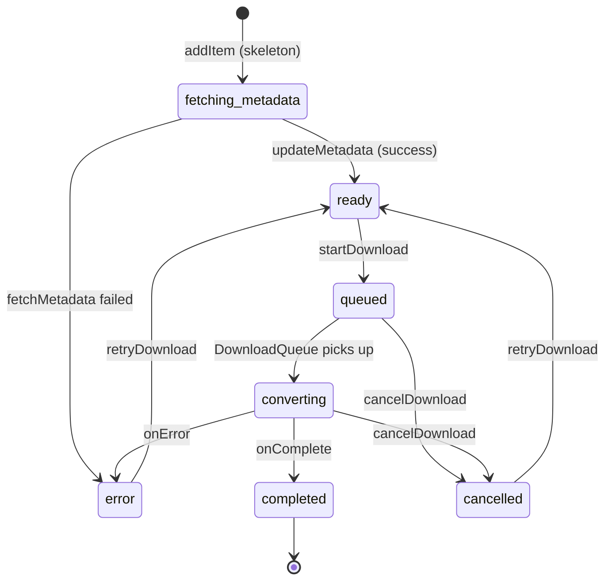
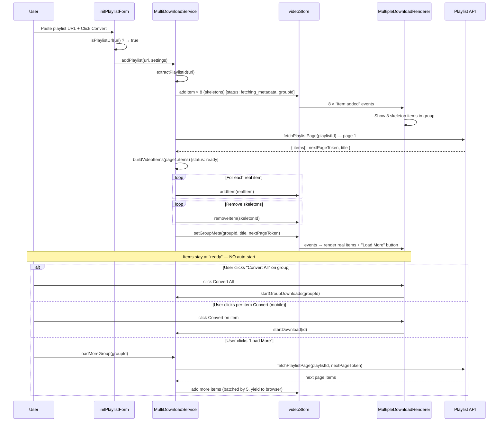
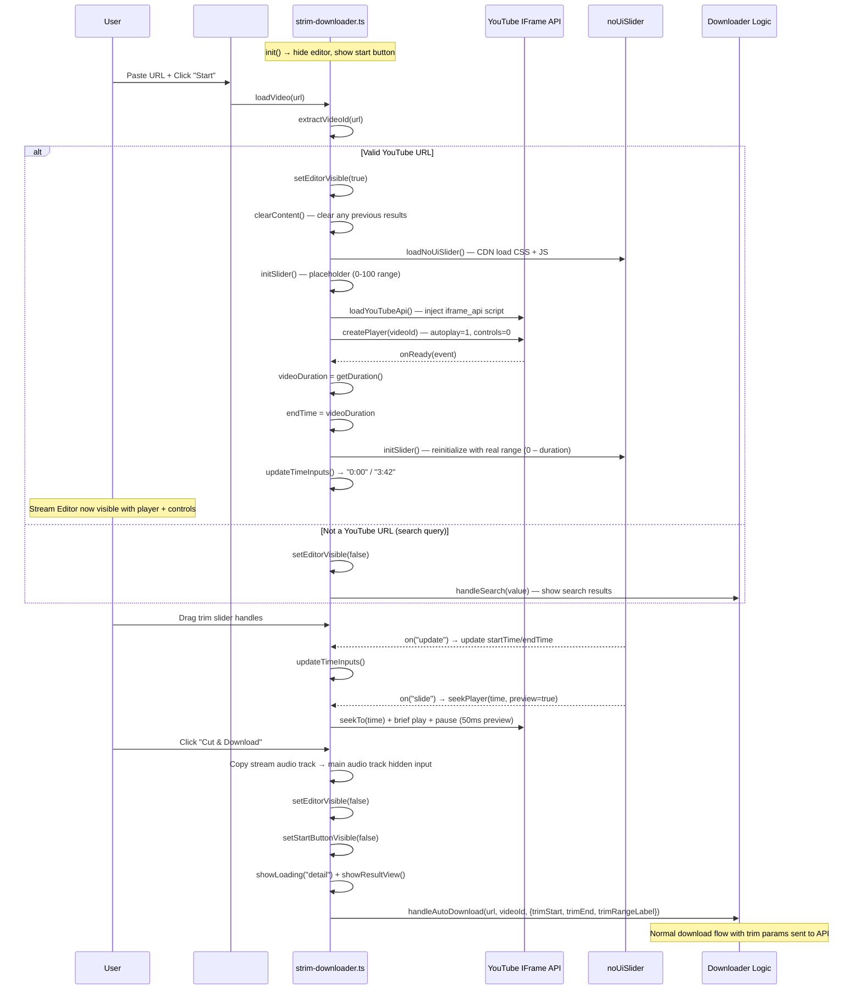

# Ezconv Project Pages — Base Document

> **Purpose**: Reference guide for future AI interactions. Details the structure, purpose, UI/UX, and functionality of every page in the Ezconv project.

---

## Project Overview

| Property | Value |
|---|---|
| **Project** | Ezconv (ezconv.pro) — YouTube Video Downloader |
| **Root** | `f:\downloader\Project-root\apps\ezconv` |
| **Stack** | HTML + TypeScript (Vite), CSS |
| **Features** | Single download, Cut/Trim, Multi download, Playlist download |
| **i18n** | 19 languages (hreflang/lang-selector on every page) |

---

## Architecture Overview

### Source Directory Structure

```
src/
├── main.ts                       ← Entry for index.html (single download)
├── strim-downloader-main.ts      ← Entry for cut-video-youtube.html
├── multi-downloader-main.ts      ← Entry for youtube-multi-downloader.html & new-ux.html
├── playlist-downloader-main.ts   ← Entry for download-mp3-youtube-playlist.html
├── environment.ts
├── styles/
│   ├── index.css                 ← Main CSS (imported by all entry points)
│   └── features/
│       └── multiple-downloader-v2.css  ← Used by multi & playlist pages
├── features/
│   ├── downloader/               ← Core download logic (shared)
│   │   ├── downloader-ui.ts      ← Main UI init for single download
│   │   ├── logic/                ← 19 files: download flow, API, mapping
│   │   ├── state/                ← 16 files: conversion, format, video store
│   │   ├── ui-render/            ← 8 files + multiple-download/ subdir
│   │   │   ├── content-renderer.ts
│   │   │   ├── download-rendering.ts
│   │   │   ├── dropdown-logic.ts ← Audio track dropdown init
│   │   │   ├── gallery-renderer.ts
│   │   │   ├── multiple-download/ ← 8 files: renderer, strategy
│   │   │   └── ...
│   │   └── routing/              ← 3 files: URL routing
│   ├── strim-downloader/
│   │   └── strim-downloader.ts   ← Cut video logic (17.5KB)
│   ├── tip-message/
│   ├── trustpilot/
│   └── widget-level-manager.ts
├── adapters/
├── api/
├── constants/
├── libs/
├── loaders/
├── ui-components/
└── utils/
```

### Shared Components Across All Pages

Every page includes these identical structural elements:

| Component | Description |
|---|---|
| **Header** | Logo (`ezconv.pro`), nav links (Home, About), language selector dropdown |
| **Mobile Drawer** | Hamburger menu → slide-out drawer with nav links, feature links, language selector |
| **Footer** | Two rows of links (feature pages + legal pages), copyright notice |
| **FOUC Script** | Inline `<script>` that reads `Ezconv_format_preferences` from localStorage to set `data-format` attribute before render |
| **JSON-LD** | Schema.org structured data: WebPage, SoftwareApplication, FAQPage, HowTo |
| **hreflang** | 19 language alternate links for multilingual SEO |
| **Format Preferences** | Inline script restoring saved format/quality from localStorage |

### Shared TypeScript Init (duplicated in each entry point)

Each entry point duplicates these functions:
- `initMobileMenu()` — hamburger open/close/escape
- `initHeaderScroll()` — `.scrolled` class on scroll > 10px
- `initLangSelector()` — desktop language dropdown toggle
- `initDrawerLangSelector()` — mobile drawer language dropdown toggle
- `initFirebaseAnalytics()` — lazy-loaded after 5s delay

---

## Page 1: `index.html` — Single Video Download

| Property | Value |
|---|---|
| **URL** | `https://ezconv.pro/` |
| **Title** | Ezconv - Free YouTube Converter and Downloader Online (No Ads) |
| **Entry Point** | [main.ts](file:///f:/downloader/Project-root/apps/ezconv/src/main.ts) |
| **CSS** | `src/styles/index.css` |
| **Total lines** | 739 |

### Purpose
The **primary/home page**. Downloads a single YouTube video as MP4 or MP3.

### UI Structure (Body)

```
<main>
  └── Hero Section (.hero-section)
      ├── Hero Header: h1 + subtitle
      └── Hero Card (.hero-card)
          ├── <form #downloadForm>
          │   ├── Input Group (#input-container)
          │   │   ├── Input Wrapper
          │   │   │   ├── <input #videoUrl> — "Paste YouTube video URL here..."
          │   │   │   └── Paste/Clear button (#input-action-button)
          │   │   └── Suggestion Container (#suggestion-container)
          │   ├── Format Selector (#format-selector-container)
          │   │   ├── Format Toggle: [MP4] [MP3] (.format-btn)
          │   │   └── Quality Wrapper
          │   │       ├── <select #quality-select-mp3> (MP3 qualities)
          │   │       └── <select #quality-select-mp4> (MP4 qualities)
          │   ├── Audio Track Hidden Input (#audio-track-value)
          │   └── Convert Button (#btn-convert)
          └── Error Message (#error-message)
      └── Result View (#result-view)
          └── Content Area (#content-area)
  └── Search Results Section (#search-results-section) — hidden
  └── Overview Section (#about)
  └── FAQ Section (#faq)
</main>
```

### Key Form Elements

| Element | ID | Type | Options |
|---|---|---|---|
| URL Input | `videoUrl` | text | Single URL |
| Format Toggle | `.format-btn` | buttons | MP4 (default), MP3 |
| MP4 Quality | `quality-select-mp4` | select | 4K, 1080p, 720p (default), 480p, 360p, 144p, WEBM, MKV |
| MP3 Quality | `quality-select-mp3` | select | 128kbps (default), 320kbps, OGG, WAV, Opus, M4A |
| Audio Track | `audio-track-value` | hidden | Default: "original" |
| Audio Dropdown | `#audio-track-dropdown` | custom dropdown | Populated dynamically |
| Convert | `btn-convert` | button | Triggers download |

### User Flow
1. Paste YouTube URL → input field
2. Select format (MP4/MP3)
3. Select quality from dropdown
4. (Optional) Select audio track language
5. Click **Convert** → result appears in `#content-area`

### TypeScript Logic (`main.ts`)
- Imports `src/styles/index.css`
- Calls `initDownloaderUI()` → lazy imports `features/downloader/downloader-ui.ts` → `init()`
- Calls `initAudioDropdown()` from `dropdown-logic.ts`
- Exposes `__conversionState__` on window for debugging

---

## Page 2: `cut-video-youtube.html` — Cut/Trim YouTube Video

| Property | Value |
|---|---|
| **URL** | `https://ezconv.pro/cut-video-youtube` |
| **Title** | Ezconv - Cut Video YouTube Online (No Ads) |
| **Entry Point** | [strim-downloader-main.ts](file:///f:/downloader/Project-root/apps/ezconv/src/strim-downloader-main.ts) |
| **CSS** | `src/styles/index.css` |
| **Total lines** | 780 |

### Purpose
Allows users to **cut/trim a specific segment** from a YouTube video, then download it as MP4 or MP3.

### UI Structure (Body)

```
<main>
  └── Hero Section (.hero-section)
      ├── Hero Header: h1 + subtitle
      └── Hero Card (.hero-card)
          ├── Card Title: "YouTube Video Cutter"
          └── Search View (#search-view)
              └── <form #downloadForm>
                  ├── Input Group (#input-container)
                  │   └── Stream Input Row
                  │       ├── Input Shell → <input #videoUrl>
                  │       │   └── Paste/Clear button (#input-action-button)
                  │       └── Start Button (#stream-start-btn) — "Start"
                  ├── Suggestion Container (#suggestion-container)
                  ├── Format Selector (#format-selector-container) — hidden initially
                  │   └── Format toggle + quality selects (minimal: 720p only, 128kbps only)
                  ├── Audio Track Hidden Input (#audio-track-value)
                  └── Stream Editor (#stream-editor) — hidden initially
                      ├── Player Wrap (#stream-player) — YouTube embed
                      └── Stream Settings (.stream-settings)
                          ├── Step 1: Format Toggle (#stream-format-toggle)
                          │   └── [MP3 (default selected)] [MP4]
                          ├── Step 2: Quality Select (#stream-quality-select)
                          │   └── <select> — populated dynamically
                          ├── Step 3: Audio Track (#stream-audio-track-row)
                          │   └── Custom dropdown (#stream-audio-track-dropdown)
                          ├── Step 4: Cut Video (Start – End time)
                          │   ├── Trim Slider (#trim-slider) — range slider
                          │   ├── Start Time Input (#trim-start) — "0:00"
                          │   └── End Time Input (#trim-end) — "0:00"
                          └── Cut & Download Button (#stream-convert-btn)
          └── Error Message (#error-message)
          └── Result View (#result-view) — hidden
  └── Search Results Section (#search-results-section) — hidden
  └── Overview Section
  └── FAQ Section
</main>
```

### Key Differences from `index.html`

| Feature | index.html | cut-video-youtube.html |
|---|---|---|
| Input action | Paste → Convert | Paste → **Start** → Stream Editor opens |
| Format default | MP4 | **MP3** (in stream editor) |
| Quality selects | Full lists (static) | Minimal initial; **dynamic** in stream editor |
| Video preview | None | **YouTube embed player** in stream editor |
| Trim controls | None | **Trim slider + start/end time inputs** |
| CTA button | "Convert" | **"Cut & Download"** |
| Extra element | None | `#stream-start-btn` ("Start" button) |

### User Flow
1. Paste YouTube URL
2. Click **Start** → Stream Editor appears with video player
3. Select format (MP3 default / MP4)
4. Select quality (dynamically populated)
5. (Optional) Select audio track
6. **Drag trim slider** or type start/end times
7. Click **Cut & Download**

> See [Cut-Video Detailed Processing Flow](#cut-video-detailed-processing-flow) for the complete technical sequence.

### TypeScript Logic (`strim-downloader-main.ts`)
- Intercepts form submit to trigger `#stream-start-btn` click instead
- Calls `initDownloaderUI()` (same as index)
- Lazy imports `features/strim-downloader/strim-downloader.ts` → `init()`
- `strim-downloader.ts` is a single 17.5KB file handling all cut/trim logic

---

## Page 3: `youtube-multi-downloader.html` — Multi Video Download

| Property | Value |
|---|---|
| **URL** | `https://ezconv.pro/youtube-multi-downloader` |
| **Title** | Ezconv - YouTube Multi Download Online (No Ads) |
| **Entry Point** | [multi-downloader-main.ts](file:///f:/downloader/Project-root/apps/ezconv/src/multi-downloader-main.ts) |
| **CSS** | `src/styles/features/multiple-downloader-v2.css` |
| **Total lines** | 700 |

### Purpose
Download **multiple YouTube videos at once** by pasting multiple URLs (one per line).

### UI Structure (Body)

```
<main>
  └── Hero Section (.hero-section)
      ├── Hero Header: h1 + subtitle
      └── Multi Download Card (#multi-download-form .multiple-download-card)
          ├── URLs Input Container
          │   └── <textarea #urlsInput> — "Paste YouTube URLs here (one per line)"
          ├── Form Actions (#multi-download-form-actions)
          │   └── Format Selector Wrapper
          │       ├── Format Toggle (.multi-format-toggle)
          │       │   └── [MP4 (default)] [MP3] (.multi-format-btn)
          │       ├── Quality Wrapper
          │       │   ├── <select #multi-quality-select-mp3> (Audio qualities)
          │       │   └── <select #multi-quality-select-mp4> (Video qualities)
          │       ├── Audio Track Dropdown (#multi-audio-track-dropdown)
          │       │   └── Custom dropdown with search
          │       │   └── Hidden input (#multi-audio-track-value)
          │       └── Convert Button (#addUrlsBtn) — "Convert"
          └── Error Message (#error-message)
  └── Video List Section (.video-list-section)
      └── Container (#multiple-downloads-container) — hidden initially
          └── (Video items rendered by MultipleDownloadRenderer)
  └── Overview Section
  └── Content Section (Why/Formats/Comparison)
  └── FAQ Section
</main>
```

### Key Differences from `index.html`

| Feature | index.html | youtube-multi-downloader.html |
|---|---|---|
| Input type | Single `<input>` | **`<textarea>`** for multiple URLs |
| CSS classes | `.format-btn`, `.quality-select` | **`.multi-format-btn`**, **`.multi-quality-select`** |
| CSS file | `index.css` | **`multiple-downloader-v2.css`** |
| Results area | `#content-area` in `#result-view` | **`#multiple-downloads-container`** (separate section) |
| CTA button ID | `btn-convert` | **`addUrlsBtn`** |
| Audio dropdown ID | `audio-track-dropdown` | **`multi-audio-track-dropdown`** |

### User Flow
1. Paste multiple YouTube URLs (one per line) into textarea
2. Select format (MP4/MP3) — shared across all URLs
3. Select quality — shared across all URLs
4. (Optional) Select audio track
5. Click **Convert** → video items appear in `#multiple-downloads-container`
6. Each video processes and shows individual download buttons

> See [Multi-Download Detailed Processing Flow](#multi-download-detailed-processing-flow) for the complete technical sequence.

### TypeScript Logic (`multi-downloader-main.ts`)
- Self-contained entry point (325 lines), does NOT import `downloader-ui.ts`
- Key functions:
  - `initFormatToggle()` — handles MP4/MP3 toggle + quality visibility
  - `saveFormatPreferences()` — persists to localStorage
  - `getCurrentSettings()` — reads format/quality/audioTrack from UI
  - `initMultiDownloadForm()` — parses URLs, creates download items
- Imports `MultipleDownloadRenderer` and `VideoItemSettings`
- Uses `initAudioDropdown()` for the audio track dropdown
- Renderer uses **Batch strategy** (`multipleDownloadRenderer.useBatchStrategy()`)

---

## Page 4: `download-mp3-youtube-playlist.html` — Playlist Download

| Property | Value |
|---|---|
| **URL** | `https://ezconv.pro/download-mp3-youtube-playlist` |
| **Title** | Ezconv - Download MP3 YouTube Playlist Online (No Ads) |
| **Entry Point** | [playlist-downloader-main.ts](file:///f:/downloader/Project-root/apps/ezconv/src/playlist-downloader-main.ts) |
| **CSS** | `src/styles/features/multiple-downloader-v2.css` |
| **Total lines** | 721 |

### Purpose
Download an **entire YouTube playlist** by pasting a single playlist URL. Supports both MP4 and MP3.

### UI Structure (Body)

```
<main>
  └── Hero Section (.hero-section)
      ├── Hero Header: h1 + subtitle
      └── Playlist Download Card (#playlist-download-form .multiple-download-card)
          ├── URLs Input Container (no border)
          │   └── Input Wrapper
          │       ├── <input #playlistUrl> — "Paste playlist URL here..."
          │       └── Paste/Clear button (#input-action-button)
          ├── Form Actions (#multi-download-form-actions)
          │   └── Same format/quality/audio layout as multi-downloader
          │       └── Convert Button (#fetchPlaylistBtn type="submit") — "Convert"
          └── Error Message (#error-message)
  └── Video List Section (.video-list-section)
      └── Container (#multiple-downloads-container) — hidden
  └── Overview Section
  └── Content Section
  └── FAQ Section
</main>
```

### Key Differences from Multi-Downloader

| Feature | Multi Downloader | Playlist Downloader |
|---|---|---|
| Input type | `<textarea>` (multiple URLs) | **Single `<input>`** (one playlist URL) |
| Input ID | `urlsInput` | **`playlistUrl`** |
| Has paste/clear button | No (just textarea) | **Yes** (`#input-action-button`) |
| CTA button | `#addUrlsBtn` (type=button) | **`#fetchPlaylistBtn`** (type=submit) |
| URL validation | Checks individual video URLs | **Checks for playlist URL** (`isPlaylistUrl()`) |
| ZIP support | Not mentioned | **Desktop**: ZIP download, **Mobile**: individual files |
| Quality emphasis | Both formats equal | **MP3 emphasis** (despite supporting both) |

### User Flow
1. Paste a YouTube **playlist URL** (or single video URL) into input field
2. Select format (MP4/MP3)
3. Select quality
4. (Optional) Select audio track
5. Click **Convert** → playlist videos appear in `#multiple-downloads-container`
6. Desktop: option to download all as ZIP; Mobile: individual downloads

> See [Playlist Detailed Processing Flow](#playlist-detailed-processing-flow) for the complete technical sequence.

### TypeScript Logic (`playlist-downloader-main.ts`)
- Similar structure to `multi-downloader-main.ts` (369 lines)
- Additional features:
  - `initInputActions()` — paste/clear button state management
  - Uses `isPlaylistUrl()` and `extractVideoId()` from `@downloader/core`
  - `initPlaylistForm()` — fetches playlist metadata, creates items
  - Also supports **single video URLs** via `addSingleVideoAsGroup()`
- Same shared functions: `initFormatToggle()`, `saveFormatPreferences()`, `getCurrentSettings()`
- Renderer uses **Playlist strategy** (`multipleDownloadRenderer.usePlaylistStrategy()`)

---

## Page 5: `new-ux.html` — New Unified UX (Work in Progress)

| Property | Value |
|---|---|
| **URL** | (not yet deployed) |
| **Title** | Ezconv - YouTube Multi Download Online (No Ads) |
| **Entry Point** | [multi-downloader-main.ts](file:///f:/downloader/Project-root/apps/ezconv/src/multi-downloader-main.ts) |
| **CSS** | `src/styles/features/multiple-downloader-v2.css` |
| **Total lines** | 700 |

### Current State

> [!CAUTION]
> `new-ux.html` is currently an **exact clone** of `youtube-multi-downloader.html`. No unique functionality implemented yet.

### Intended Purpose
**All-in-one consolidated UI** combining all four download modes: single, cut/trim, multi, playlist.

### UI/UX Design Specification

#### Form Card — Basic Mode (Default)

Base layout = **identical to `youtube-multi-downloader.html`** with these changes:
- ❌ **Remove**: `dropdown-trigger` (audio track dropdown) from the basic form
- ➕ **Add**: "⚙️ Advanced Settings ▼" toggle at the **bottom** of the form card

```
┌─── Form Card ────────────────────────────────────┐
│  ┌──────────────────────────────────────────────┐ │
│  │ Paste YouTube URLs here (one per line)       │ │
│  │                                     [Paste]  │ │
│  └──────────────────────────────────────────────┘ │
│                                                   │
│  [MP4] [MP3]   [Quality ▾]        [Convert]       │
│                                                   │
│  ⚙️ Advanced Settings ▼                           │
└───────────────────────────────────────────────────┘
```

> If user does NOTHING except paste URL(s) and click Convert → works with defaults (MP4, 720p). No friction.

#### Advanced Settings Panel (toggle show/hide)

Clicking "⚙️ Advanced Settings" reveals a panel with **3 items in a single row**:

```
┌─── Advanced Settings ────────────────────────────┐
│  Audio Track          Playlist Mode    Strim/Cut  │
│  [Dropdown ▾]         [OFF] [ON]       [OFF] [ON] │
└───────────────────────────────────────────────────┘
```

| Item | Label (top) | Control (bottom) | Default |
|---|---|---|---|
| **Audio Track** | "Audio Track" | Custom dropdown with search | "Original" |
| **Playlist Mode** | "Playlist Mode" | Toggle button [OFF] / [ON] | OFF |
| **Strim / Cut Video** | "Strim / Cut" | Toggle button [OFF] / [ON] | OFF |

> [!WARNING]
> **Strim toggle validation**: Toggle ON is only allowed when textarea has **exactly 1 URL**.
> - Empty input → warning: "Please paste a YouTube URL first" → stays OFF
> - Multiple URLs → warning: "Cut mode only supports a single URL" → stays OFF

> [!IMPORTANT]
> **Strim ↔ Playlist Mode are mutually exclusive.** Turning one ON automatically turns the other OFF.
> - Strim ON → Playlist Mode auto-OFF
> - Playlist Mode ON → Strim auto-OFF

> [!NOTE]
> **Convert button is the ONLY action button.** No "Start" or "Cut & Download" button.
> User completes all settings FIRST (format, quality, audio track, trim range if strim ON), then clicks **Convert**.
> Convert captures all current settings (including trim start/end if strim is ON) and executes.
> **Toggle changes only affect the NEXT Convert** — existing groups/items are never affected.

#### Strim/Cut Toggle ON → Cutting UI

When Strim toggle = ON, a cutting interface appears **below** the Advanced Settings:

**Desktop (2 columns)**:
```
┌─── Cutting Interface ────────────────────────────┐
│ ┌─────────────────┐  ┌──────────────────────────┐ │
│ │                 │  │                          │ │
│ │  YouTube Player │  │ ═══●════════●═══ slider  │ │
│ │  (iframe embed) │  │                          │ │
│ │    50% width    │  │ Start: [0:00] End:[3:42] │ │
│ │                 │  │                          │ │
│ └─────────────────┘  └──────────────────────────┘ │
└───────────────────────────────────────────────────┘
```

**Mobile (1 column)**:
```
┌─── Cutting Interface ─────┐
│ ┌───────────────────────┐  │
│ │   YouTube Player      │  │
│ │   (iframe embed)      │  │
│ └───────────────────────┘  │
│ ═══●════════●═══ slider   │
│ Start: [0:00] End: [3:42] │
└────────────────────────────┘
```

> Cutting UI only shows **player + slider + time inputs**. Format/quality/audio settings remain in the main form above. The main **Convert** button submits everything (including trim params).

### Playlist Mode — Grouping Logic

> [!IMPORTANT]
> **No auto-detect.** User explicitly controls grouping behavior via the **Playlist Mode toggle**.

#### Playlist Mode = OFF (default)

**All URLs are treated as flat batch items**, regardless of type:

| Input | Behavior |
|---|---|
| Single video URL | → add as item to General Group (Batch) |
| Playlist URL | → **extract individual videos** → add all as flat items to General Group (8 skeletons while loading, then replace with real items) |
| Multiple URLs (mix) | → all become flat items in General Group |

**Merge rules apply** (check TOP group):
- Top = General Group → merge items into it
- Top = Playlist Group (from a previous Playlist Mode ON action) → create new General Group

#### Playlist Mode = ON

**Every link creates its own group**:

| Input | Behavior |
|---|---|
| Playlist URL | → create **Playlist Group** (with playlist title, tabs, Load More) |
| Single video URL | → create **1-item Group** (treated as group with 1 video) |
| Multiple links pasted | → **N groups** (1 per link), each link = separate group |

**No merge** — every link always creates a new group.

#### Example Timeline (mixed usage)

```
Playlist Mode OFF:
1: Paste 3 URLs → [Batch 1: item1-3]
2: Paste 1 URL  → [Batch 1: item1-4]              ← merged

Switch to Playlist Mode ON:
3: Paste playlist → [📋 "Lo-Fi": 12 videos]  / [Batch 1]
4: Paste 1 video  → [📋 "Video X": 1 video]  / [📋 "Lo-Fi"] / [Batch 1]

Switch back to Playlist Mode OFF:
5: Paste 2 URLs → [Batch 2: item5-6] / [📋 "Video X"] / [📋 "Lo-Fi"] / [Batch 1]
6: Paste 1 URL  → [Batch 2: item5-7] / ...        ← merged (top=General)
```

### Two Types of Groups (summary)

| | **General Group (Batch)** | **Playlist Group** |
|---|---|---|
| **Name** | "Batch 1", "Batch 2"... | Playlist title from API / "Video Title" for 1-item |
| **Created when** | Playlist Mode OFF | Playlist Mode ON |
| **Settings** | Global badges (from form) | Per-item editable dropdowns |
| **Auto-start** | ✅ Yes | ❌ No (user triggers) |
| **Tabs** | No | ✅ Convert / Download |
| **Load More** | No | ✅ (if playlist has pages) |
| **Merge** | ✅ (if top group is General) | ❌ Never |

---

## Multi-Download Detailed Processing Flow

### Architecture: Store-Driven Rendering

Both Multi-download and Playlist share the same rendering infrastructure:



- **[videoStore](file:///f:/downloader/Project-root/apps/ezconv/src/features/downloader/state/video-store.ts)** — Central event-driven store (`subscribe()` emits `item:added`, `item:updated`, `item:removed`)
- **[MultipleDownloadRenderer](file:///f:/downloader/Project-root/apps/ezconv/src/features/downloader/ui-render/multiple-download/multiple-download-renderer.ts)** — Subscribes to store, creates/updates DOM elements
- **[VideoItemRenderer](file:///f:/downloader/Project-root/apps/ezconv/src/features/downloader/ui-render/multiple-download/video-item-renderer.ts)** — Static class for per-item DOM creation and granular updates
- **Strategy Pattern** — `MultiDownloadStrategy` (batch) or `PlaylistStrategy` determines settings display and action buttons

### Multi-Download Complete Sequence



### Video Item DOM Structure (per item)

Each video item in the list renders as:

```
.multi-video-item [data-id="xxx"]
├── .item-checkbox-wrapper             ← checkbox for batch selection
│   └── input.item-checkbox
├── .multi-video-thumb                 ← thumbnail + duration badge
│   ├── img [src=thumbnail]
│   └── span.multi-video-duration      ← e.g. "3:42"
├── .multi-video-info                  ← main content area
│   ├── .multi-video-title             ← video title
│   ├── .multi-video-meta
│   │   └── span.multi-video-author    ← channel name
│   ├── .multi-video-error             ← error message (hidden by default)
│   └── .settings-progress-wrapper
│       ├── .item-settings             ← format/quality badges OR dropdowns
│       │   └── (Strategy-specific content)
│       └── .item-active-progress      ← progress bar (shown during download)
│           ├── .progress-info-row
│           │   ├── .multi-video-phase-label  ← "Downloading...", "Processing..."
│           │   └── .progress-percentage-label ← "42%"
│           └── .multi-video-progress
│               └── .progress-bar [style="width: 42%"]
├── .multi-video-status                ← status badges
│   └── span.status-badge              ← "Pending", "Ready", "Downloaded", etc.
└── .multi-video-actions               ← action buttons
    └── (Strategy-specific buttons)
```

**Skeleton state** (`fetching_metadata`): All content areas show pulsing `.skeleton-box` / `.skeleton-text` placeholders instead of real data.

### Item Status Lifecycle (Multi-Download / Batch)



### Batch Strategy (`MultiDownloadStrategy`) — Settings Display

| State | Settings Column | Action Buttons |
|---|---|---|
| `fetching_metadata` | Skeleton placeholders | Spinner |
| `ready` | **Badge**: `"MP4 · 720p"` or `"MP3 · 128kbps"` | 🗑 Remove |
| `queued` | Badge (locked) | 🗑 Remove |
| `downloading`/`converting` | Progress bar replaces settings | ✕ Cancel |
| `completed` | Badge | ⬇ Download / ✓ Downloaded |
| `error` | Badge | 🔄 Retry + 🗑 Remove |

> [!NOTE]
> In Batch mode, **auto-start** is immediate — after `addUrls()` returns, `startAllDownloads()` is called, so items go from `ready` → `queued` → `converting` automatically. Settings are **NOT editable per-item** (always badges).

### Batch Header & Bulk Actions

Above the video list, a **batch header** appears with:
- Select All checkbox
- Item counter (e.g. "5 videos")
- **Convert All** / **Convert Selected** button
- **Download ZIP** button (Desktop only) — calls `createZipDownload(ids)` → backend bundles completed files
- **Cancel All** button (during download)

---

## Playlist Detailed Processing Flow

### Playlist Complete Sequence



### Key Differences from Multi-Download

| Aspect | Multi-Download (Batch) | Playlist |
|---|---|---|
| **Input** | Multiple URLs (textarea) | Single playlist URL or single video URL |
| **Grouping** | Flat list, no groups | Grouped by playlist (`groupId`) |
| **Skeleton count** | 1 per URL | **8 skeleton items** while fetching page 1 |
| **Item creation** | `addUrls()` → parse → skeleton → metadata | `addPlaylist()` → skeleton → API fetch → real items (already have metadata from API) |
| **Initial status** | `fetching_metadata` → `ready` (via metadata fetch) | **Directly `ready`** (metadata from playlist API) |
| **Auto-start** | ✅ Yes — `startAllDownloads()` called immediately | ❌ No — items stay `ready` until user triggers |
| **Settings per item** | Badge only (global settings applied) | **Editable dropdowns** (format, quality, audio track) when `ready` |
| **Pagination** | N/A | **"Load More" button** for next page (50 items/page) |
| **Single video support** | N/A | ✅ `addSingleVideoAsGroup()` — treated as 1-item group |
| **Strategy class** | `MultiDownloadStrategy` | `PlaylistStrategy` |

### Playlist Strategy (`PlaylistStrategy`) — Settings Display

| State | Settings Column | Action Buttons |
|---|---|---|
| `fetching_metadata` | Skeleton placeholders | Spinner |
| `ready` | **Editable dropdowns**: Format select + Quality select + Audio track select | Desktop: 🗑 Remove; Mobile: **⬇ Convert** button |
| `queued` | Badge (locked) | — |
| `downloading`/`converting` | Progress bar replaces settings | Desktop: ✕ Cancel; Mobile: ✕ Cancel |
| `completed` | Badge (locked) | ⬇ Download / ✓ Downloaded |
| `error` | **Editable dropdowns** (can change before retry) | 🔄 Retry |

> [!IMPORTANT]
> Playlist strategy has **per-item editable dropdowns** — each video can have different format, quality, and audio track. Changes are saved to `videoStore` via `data-action="changeField"` handlers. When downloading/completed, dropdowns lock to badges.

### Group Structure in DOM

Playlist items are wrapped in a group container:

```
#multiple-downloads-container
└── .multi-download-header [#multi-batch-header]
└── .multi-download-list [#multi-list]
    └── .group-container [data-group-id="PLxxxxx_1234567890"]
        ├── .group-header
        │   ├── .group-title          ← "My Playlist Name"
        │   ├── .group-item-count     ← "12 videos"
        │   ├── .group-tabs           ← [Convert | Download] tab switcher
        │   ├── .group-actions         ← Convert All / Download ZIP / Select All
        │   └── .group-toggle         ← Collapse/expand group
        └── .group-items
            ├── .multi-video-item × N
            └── .load-more-btn        ← "Load More" (if nextPageToken exists)
└── .multi-download-footer [#multi-footer]
```

### Group Tabs (Convert vs Download)

Playlist groups have a **tab system** that filters visible items:

| Tab | Shows items with status | Purpose |
|---|---|---|
| **Convert** | `pending`, `analyzing`, `fetching_metadata`, `ready`, `cancelled` | Items not yet processed |
| **Download** | `queued`, `downloading`, `converting`, `completed`, `error` | Items in progress or done |

When an item transitions from `ready` → `queued`, it **automatically moves** from the Convert tab to the Download tab.

---

## Cut-Video Detailed Processing Flow

### Cut-Video Complete Sequence



### YouTube Player Configuration

The embedded player uses these settings:

| Parameter | Value | Purpose |
|---|---|---|
| `autoplay` | 1 | Start playing immediately to get duration |
| `controls` | 0 | Hide native YouTube controls |
| `rel` | 0 | Don't show related videos |
| `modestbranding` | 1 | Minimal YouTube branding |
| `iv_load_policy` | 3 | Disable annotations |
| `fs` | 0 | Disable fullscreen button |
| `disablekb` | 1 | Disable keyboard controls |
| `playsinline` | 1 | Play inline on mobile |

### Trim Slider (noUiSlider)

- Library: [noUiSlider v15.7.1](https://cdn.jsdelivr.net/npm/nouislider@15.7.1/) — loaded from CDN on demand
- **Two handles**: start time (left) and end time (right)
- Range: `0` to `videoDuration` (in seconds), step: 1
- `behaviour: 'drag-tap'` — draggable connected region + tap to set
- Events:
  - `update` → sync `startTime`/`endTime` vars + update text inputs
  - `slide` → seek YouTube player to handle position (50ms preview: play → pause)
- Time inputs (`#trim-start`, `#trim-end`) also sync back to slider on blur/Enter

### Stream Editor Quality Options (Dynamic)

The cut-video page has **more quality options** than other pages because they are rendered dynamically by `renderQualityOptions()`:

| MP4 options | MP3 options |
|---|---|
| MP4 - 4K | MP3 - 320kbps |
| MP4 - 1080p | MP3 - 256kbps |
| MP4 - 720p | MP3 - 128kbps |
| MP4 - 480p | WAV - Lossless |
| MP4 - 360p | M4A - 128kbps |
| MP4 - 144p | Opus - 128kbps |
| WEBM | OGG - 128kbps |
| MKV | **FLAC - Lossless** |

> [!NOTE]
> Cut-video includes **MP3 256kbps** and **FLAC** options that are NOT available on other pages.

### Reset Flow

When the user clears the input or navigates away:
1. `resetForm` custom event fires → `resetStreamEditorData()`
2. Destroys slider + player instances
3. Resets all time values to 0
4. Clears audio track inputs to `"original"`
5. Re-syncs format/quality controls from state
6. Hides editor, shows start button

---

## Shared Video Item Status System

### All Possible Statuses

| Status | Badge Text | Phase Label | Progress Bar | Description |
|---|---|---|---|---|
| `fetching_metadata` | — | — | — | Skeleton loading state |
| `pending` | Pending | — | Hidden | Item created but waiting |
| `analyzing` | — | "Analyzing..." | Hidden | URL being validated |
| `ready` | Ready | — | Hidden | Metadata fetched, ready to convert |
| `queued` | Queued | "Queued..." | Hidden | Waiting in download queue |
| `downloading` | — | "Downloading..." | **Visible** | File being downloaded |
| `converting` | — | "Processing..." | **Visible** | Server-side conversion in progress |
| `completed` | Ready / Downloaded | — | Hidden | Download URL available |
| `error` | Failed | — | Hidden | Error occurred, shows error message |
| `cancelled` | Cancelled | — | Hidden | User cancelled the download |

### DownloadQueue Concurrency

- `DownloadQueue(5)` — max 5 concurrent downloads
- Items beyond 5 stay in `queued` status until a slot opens
- Each download gets its own `AbortController` for cancellation

---

## Format & Quality Options (Shared Across Pages)

### Video Formats (MP4 mode)

| Value | Label |
|---|---|
| `mp4-2160` | MP4 - 4K |
| `mp4-1080` | MP4 - 1080p |
| `mp4-720` | MP4 - 720p **(default)** |
| `mp4-480` | MP4 - 480p |
| `mp4-360` | MP4 - 360p |
| `mp4-144` | MP4 - 144p |
| `webm` | WEBM |
| `mkv` | MKV |

### Audio Formats (MP3 mode)

| Value | Label |
|---|---|
| `mp3-128` | MP3 - 128kbps **(default)** |
| `mp3-320` | MP3 - 320kbps |
| `ogg` | OGG |
| `wav` | WAV - Lossless |
| `opus` | Opus |
| `m4a` | M4A |

### Audio Track
- Custom dropdown component with search functionality
- Hidden input stores selected value (default: `"original"`)
- Options populated dynamically from video metadata

---

## Key Observations for Consolidation

### Shared Patterns
1. **Format toggle** — all pages use `[MP4] [MP3]` toggle buttons
2. **Quality dropdowns** — same options, conditional visibility based on format
3. **Audio track dropdown** — identical custom dropdown component
4. **localStorage persistence** — `Ezconv_format_preferences` key stores `selectedFormat`, `videoQuality`, `audioFormat`, `audioBitrate`
5. **FOUC prevention** — inline script reads preferences before render

### Naming Inconsistencies (multi vs single)
| Single Download | Multi/Playlist |
|---|---|
| `.format-btn` | `.multi-format-btn` |
| `.quality-select` | `.multi-quality-select` |
| `#quality-select-mp4` | `#multi-quality-select-mp4` |
| `#audio-track-dropdown` | `#multi-audio-track-dropdown` |
| `#btn-convert` | `#addUrlsBtn` / `#fetchPlaylistBtn` |

### Duplicated Code
- Mobile menu, header scroll, lang selector, drawer lang selector, and Firebase analytics functions are **copy-pasted** across all 4 TypeScript entry points
- Could be extracted into a shared `common-init.ts` module

### Cut-Video Unique Elements
- `#stream-start-btn` — separate "Start" button
- `#stream-editor` — hidden panel with YouTube player, format/quality/trim controls
- `#trim-slider`, `#trim-start`, `#trim-end` — trim range controls
- `#stream-convert-btn` — "Cut & Download" CTA
- Stepped UI: "1. Select format → 2. Select quality → 3. Audio track → 4. Cut video"
- Extra quality options: MP3 256kbps, FLAC (not on other pages)
